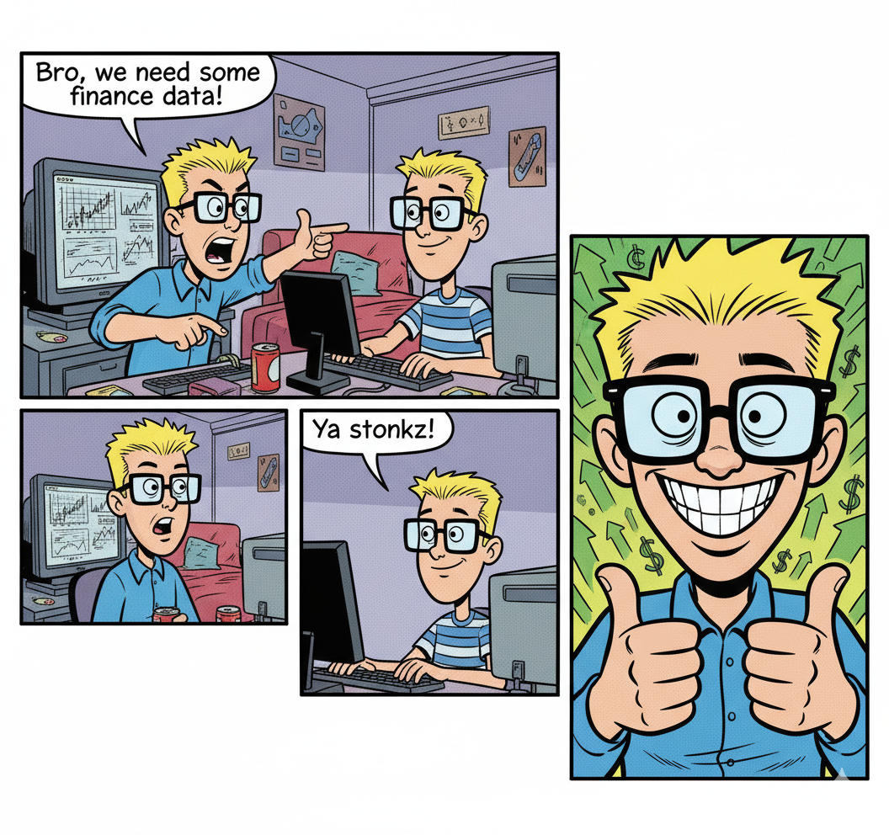

# Yafin

Unofficial [Yahoo!Ⓡ finance](https://finance.yahoo.com) API asynchronous client.

- asynchronous
- not affiliated with Yahoo, Inc.
- without returning pandas dataframes (because why?).
- oss that uses publicly available APIs
- intended for research, educational purposes and personal use only.



## Example usage

Below are example for each endpoint.

Client class has methods defined according to the API endpoints.

Stonk class is more user friendly and uses predefined modules for quote summary endpoint and predefined types for timeseries endpoints.

Some endpoints are available only to the Client class.

Output example JSONs can be found in [unit test fixtures](tests/unit/fixtures).

If needed, they can be reproduced with [fetch_mocks.py](scripts/fetch_mocks.py) script.

### chart endpoint

```python
import asyncio

from yafin import AsyncClient, Stonk

async def main() -> None:

    client = AsyncClient()
    meta_1y_chart = await client.get_chart(ticker='META', period_range='1y', interval='1d')
    aapl_5d_chart = await client.get_chart(ticker='AAPL', period_range='5d', interval='1h', events='div,split')

    meta = Stonk('META')
    meta_1y_chart = await meta.get_chart(period_range='1y', interval='1d')

    aapl = Stonk('AAPL')
    aapl_5d_chart = await aapl.get_chart(period_range='5d', interval='1h', include_div=True, include_split=False)

if __name__ == '__main__':
    asyncio.run(main())
```

### quote endpoint

```python
import asyncio

from yafin import AsyncClient, Stonk

async def main() -> None:

    client = AsyncClient()
    aapl_meta_quotes = await client.get_quote(tickers='AAPL,META')

    meta = Stonk('META')
    meta_quote = await meta.get_quote()

    aapl = Stonk('AAPL')
    aapl_quote = await aapl.get_quote()

if __name__ == '__main__':
    asyncio.run(main())
```

### quote summary endpoint

```python
import asyncio

from yafin import AsyncClient, Stonk

async def main() -> None:

    client = AsyncClient()
    meta_quote_summary = await client.get_quote_summary(
        ticker='META', modules='assetProfile,price,defaultKeyStatistics,calendarEvents'
    )

    meta = Stonk('META')
    meta_quote_summary_all_modules = await meta.get_quote_summary_all_modules()
    meta_quote_type = await meta.get_quote_type()
    meta_asset_profile = await meta.get_asset_profile()
    meta_summary_profile = await meta.get_summary_profile()
    meta_summary_detail = await meta.get_summary_detail()
    meta_income_statement_history = await meta.get_income_statement_history()
    meta_income_statement_history_quarterly = await meta.get_income_statement_history_quarterly()
    meta_balance_sheet_history = await meta.get_balance_sheet_history()
    meta_balance_sheet_history_quarterly = await meta.get_balance_sheet_history_quarterly()
    meta_cashflow_statement_history = await meta.get_cashflow_statement_history()
    meta_cashflow_statement_history_quarterly = await meta.get_cashflow_statement_history_quarterly()
    meta_esg_scores = await meta.get_esg_scores()
    meta_price = await meta.get_price()
    meta_default_key_statistics = await meta.get_default_key_statistics()
    meta_financial_data = await meta.get_financial_data()
    meta_calendar_events = await meta.get_calendar_events()
    meta_sec_filings = await meta.get_sec_filings()
    meta_upgrade_downgrade_history = await meta.get_upgrade_downgrade_history()
    meta_institution_ownership = await meta.get_institution_ownership()
    meta_fund_ownership = await meta.get_fund_ownership()
    meta_major_direct_holders = await meta.get_major_direct_holders()
    meta_major_holders_breakdown = await meta.get_major_holders_breakdown()
    meta_insider_transactions = await meta.get_insider_transactions()
    meta_insider_holders = await meta.get_insider_holders()
    meta_net_share_purchase_activity = await meta.get_net_share_purchase_activity()
    meta_earnings = await meta.get_earnings()
    meta_earnings_history = await meta.get_earnings_history()
    meta_earnings_trend = await meta.get_earnings_trend()
    meta_industry_trend = await meta.get_industry_trend()
    meta_index_trend = await meta.get_index_trend()
    meta_sector_trend = await meta.get_sector_trend()
    meta_recommendation_trend = await meta.get_recommendation_trend()
    meta_page_views = await meta.get_page_views()

if __name__ == '__main__':
    asyncio.run(main())
```

### timeseries endpoint

```python
import asyncio

from yafin import AsyncClient, Stonk

async def main() -> None:

    client = AsyncClient()
    aapl_ttm_income_stmt = await client.get_timeseries(
        ticker='AAPL',
        types='trailingNetIncome,trailingPretaxIncome,trailingEBIT,trailingEBITDA,trailingGrossProfit'
    )
    meta_annual_balance_sheet = await client.get_timeseries(
        ticker='META',
        types='annualNetDebt,annualTotalDebt',
        period1=datetime(2020, 1, 1).timestamp(),
        period2=datetime.now().timestamp(),
    )
    aapl_quarterly_cash_flow = await client.get_timeseries(
        ticker='AAPL', types='quarterlyFreeCashFlow,quarterlyOperatingCashFlow'
    )

    meta = Stonk('META')
    meta_get_income_statement = await meta.get_income_statement(frequency='trailing')
    meta_get_balance_sheet = await meta.get_balance_sheet(
        frequency='annual',
        period1=datetime(2020, 1, 1).timestamp(),
        period2=datetime.now().timestamp(),
    )
    meta_get_cash_flow = await meta.get_cash_flow(frequency='quarterly')

if __name__ == '__main__':
    asyncio.run(main())
```

### options endpoint

```python
import asyncio

from yafin import AsyncClient, Stonk

async def main() -> None:

    client = AsyncClient()
    meta_options = await client.get_options(ticker='META')

    meta = Stonk('META')
    meta_options = await meta.get_options()

if __name__ == '__main__':
    asyncio.run(main())
```

### search endpoint

```python
import asyncio

from yafin import AsyncClient, Stonk

async def main() -> None:

    client = AsyncClient()
    meta_search = await client.get_search(tickers='META')

    meta = Stonk('META')
    meta_search = await meta.get_search()

if __name__ == '__main__':
    asyncio.run(main())
```

### recommendations endpoint

```python
import asyncio

from yafin import AsyncClient, Stonk

async def main() -> None:

    client = AsyncClient()
    meta_recommendations = await client.get_recommendations(ticker='META')

    meta = Stonk('META')
    meta_recommendations = await meta.get_recommendations()

if __name__ == '__main__':
    asyncio.run(main())
```

### insights endpoint

```python
import asyncio

from yafin import AsyncClient, Stonk

async def main() -> None:

    client = AsyncClient()
    meta_insights = await client.get_insights(ticker='META')

    meta = Stonk('META')
    meta_insights = await meta.get_insights()

if __name__ == '__main__':
    asyncio.run(main())
```

### market summary endpoint

```python
import asyncio

from yafin import AsyncClient, Stonk

async def main() -> None:

    client = AsyncClient()
    market_summaries = await client.get_market_summaries()

if __name__ == '__main__':
    asyncio.run(main())
```

### trending endpoint

```python
import asyncio

from yafin import AsyncClient, Stonk

async def main() -> None:

    client = AsyncClient()
    trending = await client.get_trending()

if __name__ == '__main__':
    asyncio.run(main())
```

### currencies endpoint

```python
import asyncio

from yafin import AsyncClient, Stonk

async def main() -> None:

    client = AsyncClient()
    currencies = await client.get_currencies()

if __name__ == '__main__':
    asyncio.run(main())
```

## Research

### yfinances
https://github.com/ranaroussi/yfinance
https://ranaroussi.github.io/yfinance/

### yahooquery
https://github.com/dpguthrie/yahooquery
https://yahooquery.dpguthrie.com/

### gh open api
https://github.com/pasdam/yahoo-finance-openapi/blob/main/query2.yml
https://github.com/pasdam/yahoo-finance-openapi/blob/main/query1.yml

### gh yahoo-finance-api-collection (bruno collection)
https://github.com/Scarvy/yahoo-finance-api-collection
